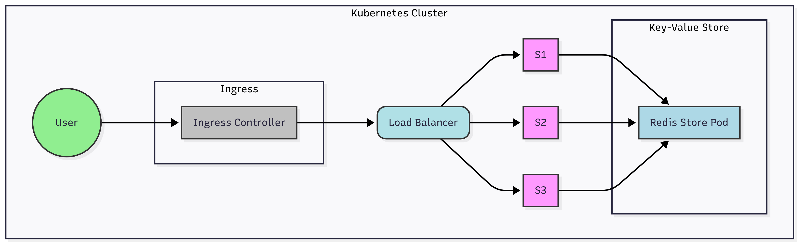
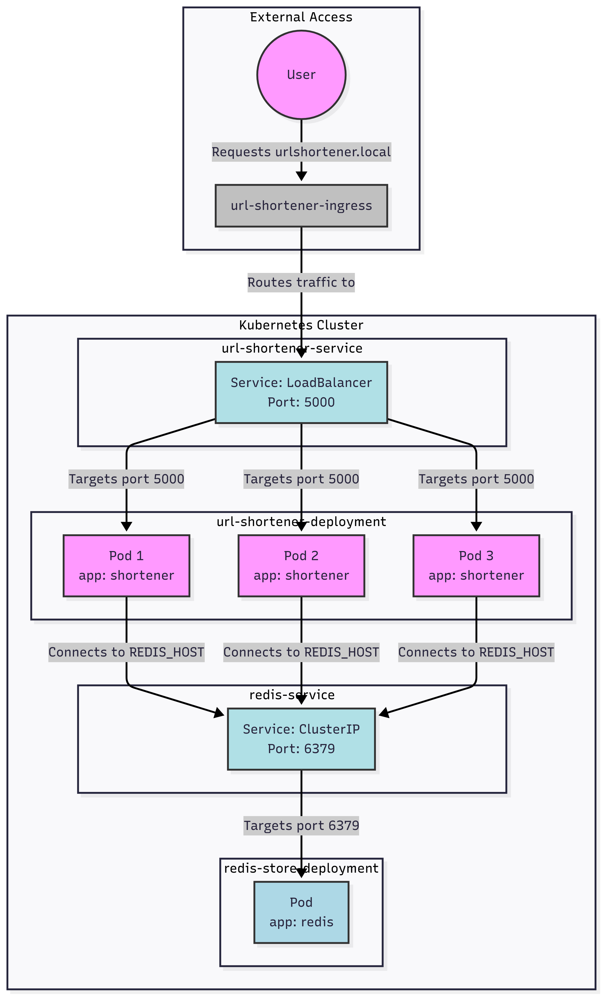
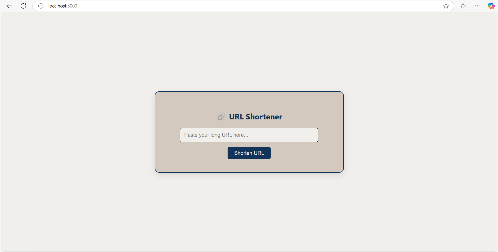
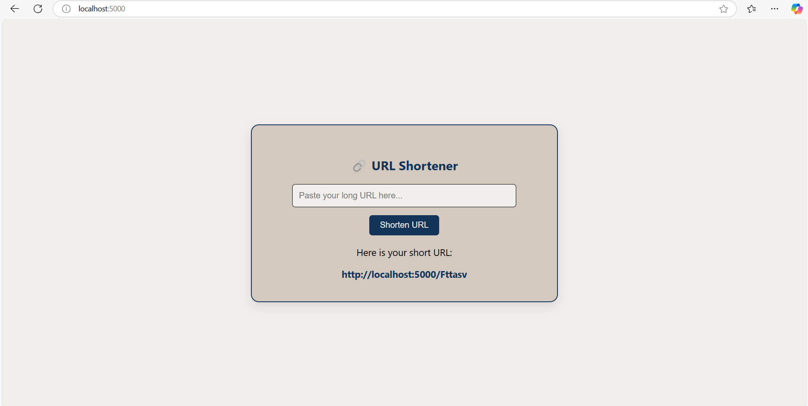
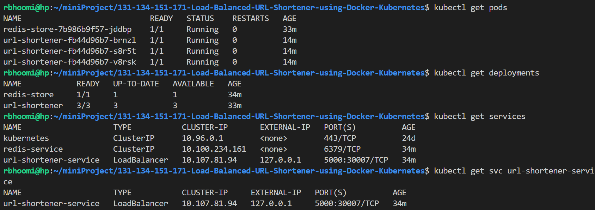
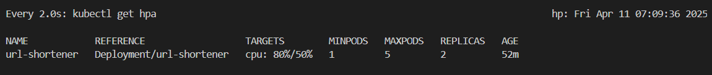
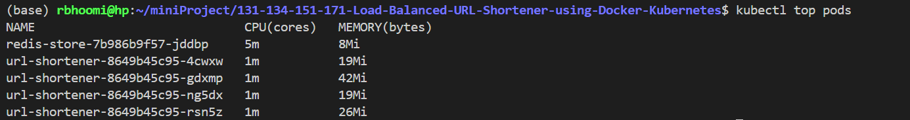

# Containerized URL Shortener

## Project Overview
A containerized URL shortener built with Python and Flask. It lets users convert long URLs into short ones. The system is scalable with Kubernetes and uses a key-value store (Redis) to save mappings.

--- 

## High-Level Design (HLD)

- **User Interaction**: Users submit long URLs and get short links.
- **Service**: Flask app generates and redirects short URLs.
- **Key-Value Store**: Redis stores mappings between short and long URLs.
- **Kubernetes**: Manages scaling and deployment.
- **Load Balancing**: Ingress controller distributes requests.

## Low-Level Design (LLD)

  

- **app.py**: Flask app with URL shortening logic.
- **Dockerfile**: Builds container image.
- **Redis Deployment/Service**: Runs Redis store in a container.
- **URL Shortener Deployment/Service**: Runs Flask app with replicas.
- **Ingress**: Routes traffic to the service.

## Tech Stack
- Backend: Python (Flask)
- Storage: Redis
- Containerization: Docker
- Orchestration: Kubernetes
- Load Balancing: Ingress

## Features
- Shorten and redirect URLs.
- Containerized with Docker.
- Kubernetes-based scaling and deployment.
- Load balanced with Ingress.

--- 

## Getting Started

### Prerequisites
- Docker
- Kubernetes (Minikube/kind/cloud)
- kubectl

### Steps
1. Clone repo and build Docker image.
2. Deploy Redis and Flask app using YAML files.
3. Apply ingress rules for external access.
4. Check pods, services, and ingress with kubectl.

---

## Demo (Screenshots)
- The URL Shortner Interface:   
- Shortened URL Display:   
- Kubernetes Status:   
- Hpa Status:   
- Ingress Status: 
